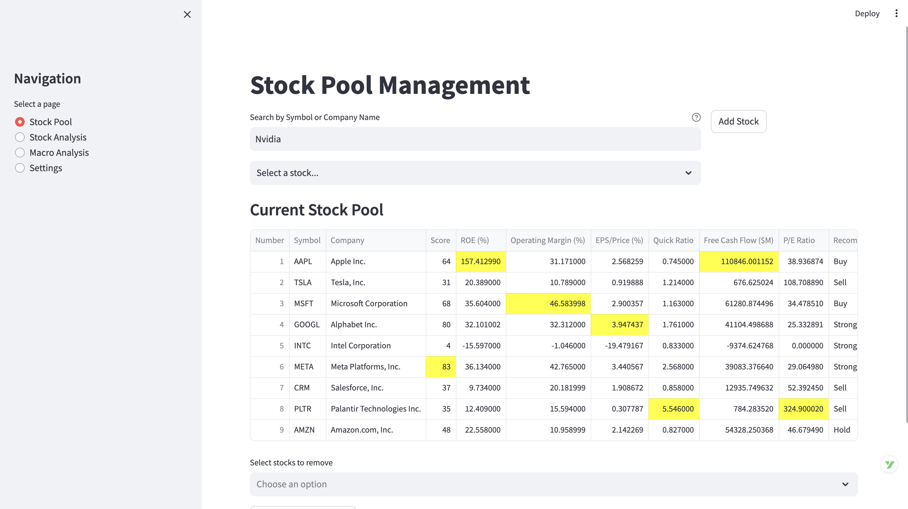
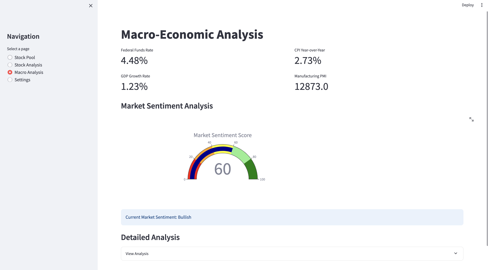
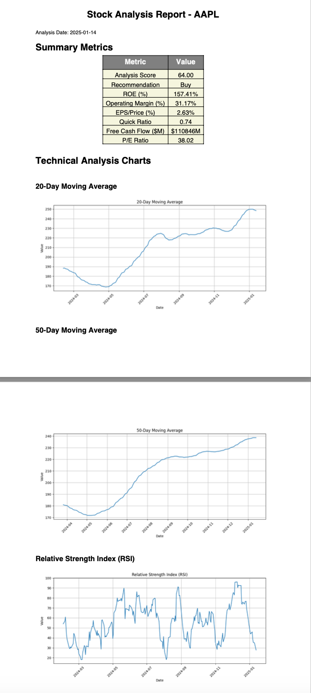

# Stock Analysis Application

A comprehensive stock analysis tool built with Python and Streamlit that provides real-time technical and fundamental analysis of stocks.

## Features

- 🔍 Real-time stock search and create your own stock pool

- 📊 Auto stock analysis and recommendations algorithms based on latest financial metrics

- 💰 Macro market evaluation based on latest data

- 📑 Export capabilities (Excel and PDF reports)


## Quick Start

1. Clone the repository:
```bash
git clone <repository-url>
cd stock-report
```

2. Create and activate a virtual environment:
```bash
python -m venv venv
source venv/bin/activate  # On Windows: venv\Scripts\activate
```

3. Install dependencies:
```bash
pip install -r requirements.txt
```

4. Run the application:
```bash
streamlit run app.py
```

## Documentation

For detailed usage instructions, please see our [User Guide](docs/user_guide.md).

## Project Structure

```
stock-report/
├── src/
│   ├── components/
│   │   ├── stock_analysis.py
│   │   ├── stock_pool.py
│   │   └── settings.py
│   ├── models/
│   │   └── stock_metrics.py
│   ├── utils/
│   │   └── storage_manager.py
│   └── main.py
├── docs/
│   └── user_guide.md
├── requirements.txt
└── README.md
```

## Dependencies

- Python 3.12+
- Streamlit
- Pandas
- Plotly
- yfinance
- And more (see requirements.txt)

## Contributing

Contributions are welcome! Please feel free to submit a Pull Request.

## License

This project is licensed under the Apache License 2.0 - see the LICENSE file for details.

## Disclaimer

This application is for informational purposes only. The analysis and information provided should not be considered as financial advice. Always conduct your own research and consult with financial professionals before making investment decisions.